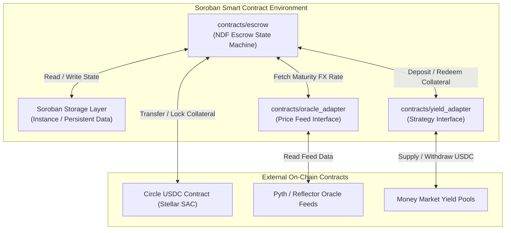

# Equator Finance: Smart Contracts (`equator-contracts`)

> **What is Equator Finance?**  
> Equator Finance is a decentralized B2B FX Forward Protocol built on Stellar (Soroban) for emerging markets. It allows corporate importers and OTC liquidity desks to trustlessly lock in future exchange rates using USDC-settled Non-Deliverable Forwards (NDFs), while routing idle collateral into decentralized yield venues to significantly offset hedging costs.
>
> **Role of this repository:** This repository contains the Rust smart contracts that serve as the protocol's core settlement engine, managing collateral escrow, oracle rate evaluation, and automated yield routing on Soroban.

📖 **Central Protocol Overview:** For the master architecture, protocol vision, and multi-repo roadmap, see the [Equator Finance Master Readme](https://github.com/Equator-Finance/.github).

---

## 🎯 Repository Scope & Overview

`equator-contracts` provides a suite of audited, non-custodial WebAssembly (WASM) smart contracts that govern the entire lifecycle of B2B Non-Deliverable Forwards (NDFs).

### Key Responsibilities:
* **Escrow Engine:** Trustless dual-sided margin locking in USDC.
* **NDF Settlement Logic:** Automated P&L calculation based on oracle exchange rates at maturity.
* **Yield Rehypothecation:** Safe routing of idle collateral into approved money market lending pools with a strict settlement-first priority waterfall.
* **Risk Engine:** Automated margin call triggers and liquidation parameters.

---

## 🏗 Smart Contract Architecture

The on-chain contracts are architected using modular Rust crates compiled to WebAssembly target `wasm32-unknown-unknown`.



### On-Chain Storage Model (Soroban)
Soroban uses 3 distinct storage lifetimes. `equator-contracts` optimizes gas and state rent by assigning data according to access frequency:
1. **Instance Storage:** Contract config parameters, admin address, oracle feed addresses, allowed yield strategy pointers.
2. **Persistent Storage:** Active `ForwardContract` records and `MarginAccount` balances. Renewed upon interaction to prevent storage expiration.
3. **Temporary Storage:** Short-lived RFQ match nonces and temporary authorization signatures.

---

## 🛠 Project Structure (Target)

```text
equator-contracts/
├── contracts/
│   ├── escrow/             # Core NDF state machine & settlement engine
│   ├── yield_adapter/      # Modular deposit/withdrawal yield strategy
│   └── oracle_adapter/    # Interface for Pyth, Reflector, & RedStone feeds
├── Cargo.toml
├── Makefile                # Build, test, and deployment scripts
└── README.md
```

---

## 🚀 Development Phases

### Phase 1: Core NDF Escrow & Settlement Engine
* **Goal:** Deliver a secure, bilateral USDC-settled NDF contract without external protocol dependencies.
* **Key Tasks & Deliverables:**
  * **Data Structures:** Define `ForwardContract`, `MarginAccount`, `ContractStatus` (`Created`, `Funded`, `Settled`, `Defaulted`).
  * **Escrow Methods:** Implement `create_forward()`, `lock_margin()`, `settle_at_maturity()`, and `cancel_expired()`.
  * **Oracle Interface:** Build basic rate-fetching interface connected to Soroban price feeds.
  * **Testing:** 100% test coverage using Cargo unit tests and Soroban environment mock testing.

### Phase 2: Yield Rehypothecation Module (Yield Strategy Adapter)
* **Goal:** Turn idle escrow collateral into a yield-generating asset to offset corporate hedging costs.
* **Key Tasks & Deliverables:**
  * **Yield Strategy Interface:** Create a modular `YieldAdapter` trait for non-custodial deposits.
  * **Money Market Integration:** Implement deposit/withdraw calls to on-chain yield venues.
  * **Capital Reserve Buffer:** Enforce a hardcoded split (e.g. 80% deposited, 20% liquid reserve).
  * **Priority Waterfall:** Ensure contract maturity calls trigger instant recall of funds from yield venues before calculating payouts.

### Phase 3: Risk Parameters & Automated Variation Margin (VM)
* **Goal:** Protect counterparties against extreme market crashes before contract maturity.
* **Key Tasks & Deliverables:**
  * **Variation Margin Engine:** Implement functions to track position health against live oracle feeds.
  * **Liquidation Triggers:** Automated default execution if a party fails to meet a margin call threshold.
  * **Multi-Oracle Aggregator:** Redundant price feed fetching with staleness checks and deviation boundaries.
  * **Protocol Fee Collector:** Deduct basis-point protocol fees on settlement or yield splits.
